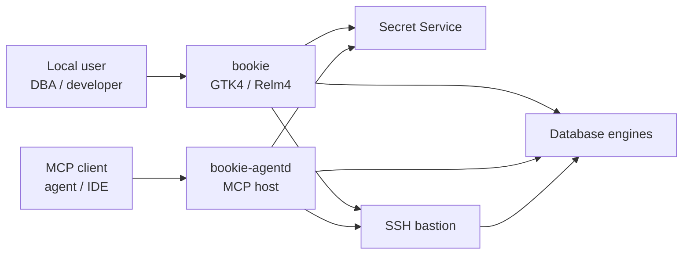
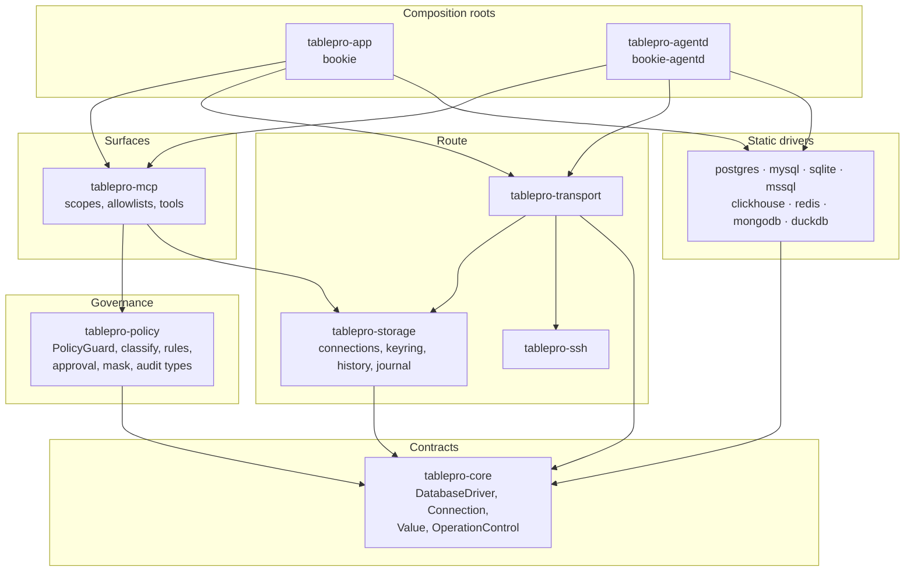
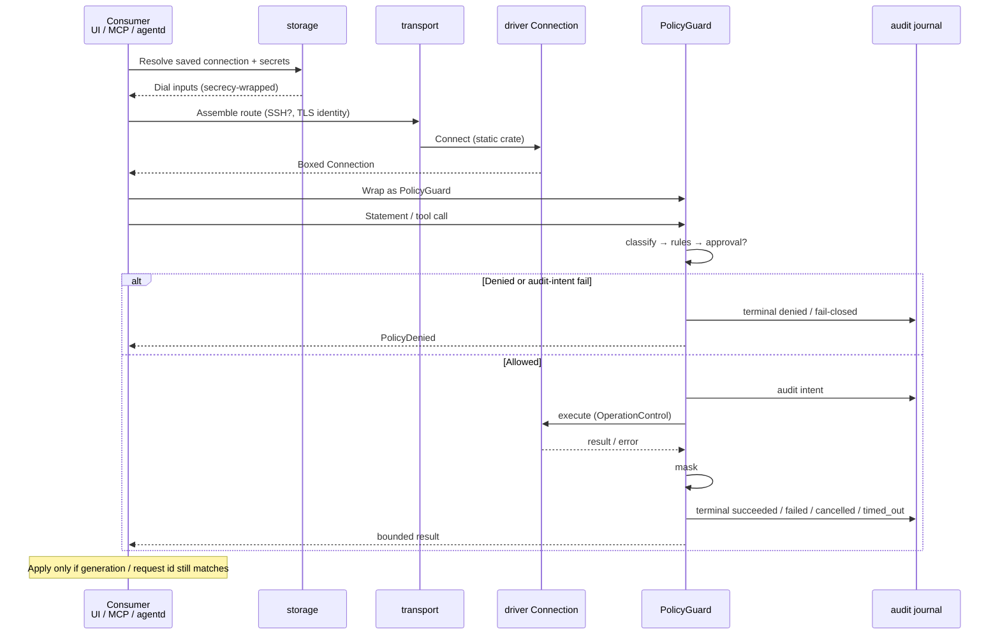
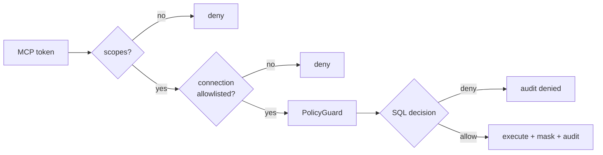
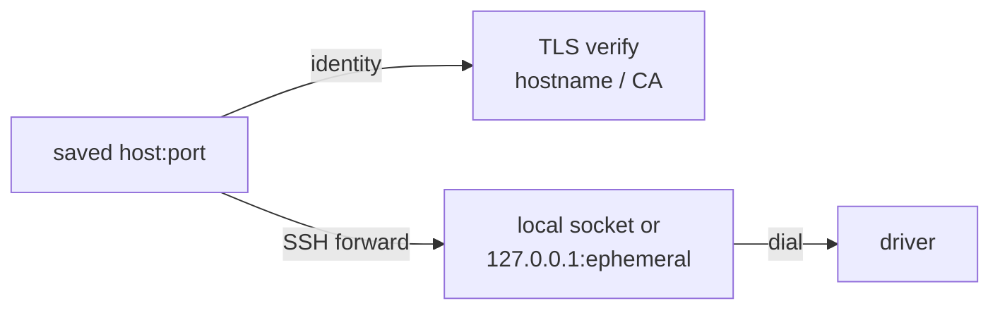

# Architecture

**BookiE** is a Linux-only native database client. Two composition roots (the GTK app and the headless MCP daemon) share one governed path: resolve credentials → open a tunnel if needed → wrap the driver in `PolicyGuard` → classify / approve / mask / execute / audit → return bounded results. There is no browser UI, no runtime driver plugin ABI, and no remote entitlement gate.

The Cargo workspace lives under `linux/` (Rust 1.98). Crate and Cargo binary names stay `tablepro-*`. Packaging and Meson install `bookie` / `bookie-agentd` and add `tablepro` / `tablepro-agentd` aliases. App ID, XDG paths, keyring schema, UUIDs, audit format and protocol contracts stay `tablepro` / `com.tablepro.linux`. Check the [active sprint](docs/bookie-0.2-sprint.md) before renaming any of them.

This page is the one-page map. Accepted [ADRs](docs/decisions/README.md) constrain behaviour; [AGENTS.md](../AGENTS.md) owns contributor rules; the sprint owns sequencing. Capability behaviour extracted from code lives under [`specs/`](../specs/README.md).

| If you want to… | Read |
|---|---|
| See crates and dependency direction | [Containers](#containers-crates), [Import DAG](#import-dag) |
| Know where a change belongs | [Where new code goes](#where-new-code-goes) |
| Follow one SQL / tool call | [Governed request pipeline](#governed-request-pipeline) |
| Understand MCP vs policy vs allowlists | [Authority boundaries](#authority-boundaries) |
| Open a tunnel or verify TLS through SSH | [Transport and service identity](#transport-and-service-identity) |
| Add an engine | [Driver contract](#driver-contract), [adding drivers](docs/adding-drivers.md) |
| Find on-disk state | [Persistence](#persistence), [storage](docs/storage.md) |
| Change UI / async ownership | [UI and async ownership](#ui-and-async-ownership) |
| See what is intentionally out of scope | [Deliberate limits](#deliberate-limits) |

## How it runs

| Mode | Process | Notes |
|---|---|---|
| Desktop | `bookie` (`tablepro-app`) | GTK on the GLib main context; DB work on Tokio via Relm4 commands |
| Headless MCP | `bookie-agentd` (`tablepro-agentd`) | Same static drivers and `PolicyGuard` path; no GTK |
| Development profile | Either binary with `TABLEPRO_PROFILE=development` | Uses `tablepro-devel` XDG paths and a separate keyring schema |
| Validation | Scripts under `linux/scripts/` | Cheap tier locally / on GitHub; merge tier on Forgejo ([playbook](docs/validation-playbook.md#ci-tiers)) |

Native library floors (build/CI vs GNOME 50 package line) are in [ADR 0002](docs/decisions/0002-rust-gtk4-libadwaita.md) and [platforms](docs/platforms.md).

## System context

One actor: the person at a Linux desktop (or an MCP client they run). BookiE stays on their machine. Outbound traffic is only to databases and SSH bastions they configure. There is no BookiE cloud account.



Both processes register the same static drivers and must obtain a `PolicyGuard` before any consumer sees a live database handle.

## Containers (crates)

Dependencies point downward. `tablepro-core` is the dependency-free contract layer. The UI never depends on a concrete driver crate.



| Crate | Role |
|---|---|
| `tablepro-app` | GTK composition root. Cargo binary `tablepro-app`; installed as `bookie`. |
| `tablepro-agentd` | Headless MCP composition root. Cargo binary `tablepro-agentd`; installed as `bookie-agentd`. |
| `tablepro-core` | Domain types, driver traits, values, filters, transactions, registry. No workspace dependency. |
| `tablepro-policy` | Classify, rules, approval, masking, blast radius, audit types, `PolicyGuard`. Depends on `core` only. |
| `tablepro-storage` | Saved connections, Secret Service, query history, audit journal. |
| `tablepro-ssh` | Built-in `russh` tunnels and optional system OpenSSH backend. |
| `tablepro-transport` | Saved-connection → dial options, SSH chain, tunnel, TLS service identity. |
| `tablepro-mcp` | MCP auth, scopes, connection allowlists, rate limits, tools. Never exposes a raw driver connection. |
| `tablepro-driver-*` | One static crate per engine. |
| `tablepro-driver-tls-tests` / `tablepro-release-tests` | Test-only fixtures. |

`crates/drivers/shared/` holds shared test helpers and is not a workspace member. Domain and driver crates never import GTK or Relm4.

## Trait boundaries

These traits are the seams that keep engines and UI replaceable. Behaviour details live in the specs and ADRs; this page only names the contracts.

| Trait / type | Crate | Job |
|---|---|---|
| `DatabaseDriver` | `core` | Connect and advertise engine capabilities. |
| `Connection` | `core` | Query, execute, schema, transactions, controlled cancel. |
| `OperationControl` | `core` | Cancellation token + optional deadline that reach the driver. |
| `PolicyGuard` | `policy` | Only consumer-facing `Connection`. Classify → decide → approve → mask → execute → audit. |
| `ApprovalSink` / `AuditSink` | `policy` | Pluggable approval UI and durable journal writes. |
| `ConnectionProvider` | `mcp` | Must return a policy-gated handle; no raw driver escape hatch. |
| `ConnectionFaultSink` | `policy` | Optional: app/agentd learn the connection is unusable after panic/desync. |

Adding an engine means implementing `DatabaseDriver` + `Connection` behind those traits, not teaching the UI a new driver id ([ADR 0001](docs/decisions/0001-no-plugin-system.md)).

## Governed request pipeline

One path for the GTK app, MCP tools and `bookie-agentd`:



| Stage | Owner | Invariant |
|---|---|---|
| Resolve | `storage` | Secrets stay in Secret Service / `secrecy` until the driver boundary. |
| Assemble route | `transport` | Dial endpoint and TLS service identity are separate fields. |
| Guard | `policy` | No raw driver handle leaves MCP or agentd. |
| Statement | `policy` | Preview, transaction, retry and batch use the same checks as direct execution. |
| Audit | `storage` journal | Denied, failed, cancelled and timed-out work still get a terminal outcome. Audit failure never opens a path around policy. |
| Apply result | consumer | Late async outcomes must not replace a newer generation. |

## Import DAG

Nothing points back up. Cycles are forbidden. Composition roots sit at the top; `core` is the leaf.

```text
tablepro-app ────────┐
tablepro-agentd ─────┼──► mcp, policy, storage, transport, ssh, drivers, core
tablepro-release-tests┘

tablepro-mcp        ──► policy, storage, core
tablepro-transport  ──► storage, ssh, core
tablepro-storage    ──► policy (audit types), ssh (config types), core
tablepro-policy     ──► core
tablepro-ssh        ──► (leaf for tunnels; config types consumed by storage/transport)
tablepro-driver-*   ──► core
tablepro-core       ──► (no workspace crate)
```

Rules that keep this sound:

1. **Two composition roots only.** `app` and `agentd` register drivers and assemble services. Domain crates do not construct GTK widgets or start Relm4.
2. **One governance seam.** Every live database handle a consumer sees is a `PolicyGuard`. Token scopes and connection allowlists never replace it.
3. **Static drivers.** Engines are linked at build time and registered in code. There is no plugin discovery ABI ([ADR 0001](docs/decisions/0001-no-plugin-system.md)).
4. **Trust at the edges.** MCP input, saved connection files, imported files, environment variables and database metadata are untrusted input.

## Where new code goes

| You are changing | Put it here |
|---|---|
| GTK widget, Relm4 component, tab or browse UX | `crates/app` (main context only for widgets) |
| Headless MCP process wiring | `crates/agentd` |
| MCP tool, token scope, allowlist or rate limit | `crates/mcp` (must still return a `PolicyGuard`) |
| Classify, approve, mask, blast radius, audit types | `crates/policy` |
| Saved connections, keyring, history, audit journal | `crates/storage` |
| Dial options, SSH chain, TLS service identity | `crates/transport` / `crates/ssh` |
| Shared value, result, driver or cancel contracts | `crates/core` |
| A database engine | New `crates/drivers/<engine>` + both composition roots ([adding drivers](docs/adding-drivers.md)) |
| Architecture or behaviour rule | An [ADR](docs/decisions/README.md); do not invent a parallel rule in a board |
| Current capability description extracted from code | [`specs/`](../specs/README.md) (draft until reviewed; ADRs and AGENTS rank above it) |
| Open work, evidence, owner | The [ledger](docs/known-issues.md) or the owning B3/B4 board |

Helpers stay in the crate that owns the behaviour. Do not grow a cross-crate “utils” layer to avoid a decision about ownership.

## Boundary checklist

- Dependencies point toward `core`. No cycles. Drivers and domain crates never import GTK or Relm4.
- Consumers never hold a raw driver `Connection`; only a `PolicyGuard`.
- Secrets stay in Secret Service / `secrecy` until the driver boundary; never in JSON, argv, traces or audit fields.
- Dial target and TLS verify hostname are separate fields under SSH ([transport](#transport-and-service-identity)).
- Late async results apply only when the generation or request id still matches.
- Preview, transaction, retry and batch paths use the same policy checks as direct execution.

## Authority boundaries

Three MCP checks answer different questions. None replaces another:

| Boundary | Answers | Owner |
|---|---|---|
| MCP token scopes | Who may call which tools? | `tablepro-mcp` |
| Connection allowlists | Which saved connections may that token use? | `tablepro-mcp` |
| `PolicyGuard` | What SQL may run, how is it masked, and what is audited? | `tablepro-policy` |



MCP may ask policy whether a statement needs write capability for a scope check; it does not evaluate rules or write audit records itself. A missing token, scope, allowlist entry or policy decision denies access.

| Concern | Behaviour |
|---|---|
| Audit durability | Intent before driver execution; terminal outcome after. Fail-closed on required audit write failures. |
| Driver panic | Guard catches unwind: reads → `Internal`, writes → `OperationOutcomeUnknown`. Payload withheld from errors, audit fields and the guard's `tracing` event (operation + message length only). Unwinding strategy: [ADR 0006](docs/decisions/0006-driver-panic-containment.md). |
| Fault sink | Optional `ConnectionFaultSink`. `app` wakes the connection monitor; `agentd` marks the session unusable for replacement; `mcp` installs no sink. Fault path skips ping. |

## State ownership

| State | Owner |
|---|---|
| Saved connections + Secret Service refs | `tablepro-storage` |
| Live tunnel / dial target + TLS identity | `tablepro-transport` / `tablepro-ssh` |
| Policy decision + audit terminal outcome | `tablepro-policy` + audit journal |
| MCP token hash, scopes, allowlist | `tablepro-mcp` |
| GTK widgets / Relm4 component state | `tablepro-app` (main context only) |
| Tab UUID, dirty rows, result generation | `tablepro-app` tab controllers |
| Browse pages (`RowStore`) | `tablepro-app` UI + bounded fetch plans |
| Driver protocol connection | Inner `Connection` behind `PolicyGuard` |

## Transport and service identity

`ConnectOptions` separates **where bytes are dialed** from **which hostname TLS must verify**.

| Mode | Dial target | TLS service identity |
|---|---|---|
| Direct | Saved host:port | Saved host |
| SSH + non-verifying | Local loopback TCP forward | Usually unused for cert checks |
| SSH + Verify CA/Full | Unix socket in a private directory when the driver reports a forwarded socket name; otherwise TCP | Saved database hostname (not `127.0.0.1`) |



PostgreSQL uses the socket form so the certificate is checked against the real database hostname while traffic crosses the bastion. Unsupported combinations fail closed. See [connections.md](docs/connections.md) and B4 C6.

## Driver contract

Each engine exports a type implementing `tablepro_core::DatabaseDriver`. Connect returns a boxed `Connection` covering query execution, parameters, schema inspection, transactions, server activity and controlled cancellation where supported.

| Engine | Library | Notes |
|---|---|---|
| PostgreSQL | SQLx | Separate control pool for server-confirmed cancel; release fixture |
| MySQL / MariaDB | SQLx | Driver + TLS fixtures |
| SQLite | SQLx | Local and GTK tests |
| SQL Server | Tiberius | Cancellation and auth limits; Kerberos optional |
| ClickHouse | `clickhouse` | Driver + TLS fixtures |
| Redis | `redis` | Experimental; single host/port in 0.2.0 |
| MongoDB | `mongodb` | Experimental |
| DuckDB | DuckDB | Optional workspace feature |

`rust_decimal` is the shared decimal carrier; exact support is recorded per type/consumer under [ADR 0007](docs/decisions/0007-type-and-value-preservation.md). Session trust: [ADR 0008](docs/decisions/0008-connection-and-session-ownership.md). Durable identity: [ADR 0009](docs/decisions/0009-persistence-and-identity-compatibility.md). Registration: [adding drivers](docs/adding-drivers.md).

## UI and async ownership

| Rule | Detail |
|---|---|
| Threading | GTK objects stay on the GLib main context. DB and blocking work run on Tokio via Relm4 commands; results return as component messages. |
| Command scope | Component-scoped commands for tab/component lifetime. Detached Relm4 tasks only for independent persistence/cleanup. |
| Tabs | `AdwTabView` workspaces; Relm4 controllers keyed by tab UUID. |
| Browse grid | Bounded pages in `RowStore` (`gio::ListModel`); weakly cached `RowObject`s. |
| SQL editor results | Materialized up to caps. Progressive server-cursor paging accepted in [ADR 0011](docs/decisions/0011-paged-query-results.md), not implemented (PERF-2/PERF-8). |
| Identity | Sidebar refresh tokens hold a weak session reference. Tab results keep their tab UUID across connection switches. |

## Persistence

Config and history live under `$XDG_CONFIG_HOME/tablepro/` (or `tablepro-devel` in development builds). The audit journal is under `$XDG_DATA_HOME/tablepro/`. Passwords and SSH secrets stay in Secret Service through `oo7`. Schema id: `com.tablepro.linux`. Details: [storage.md](docs/storage.md), [ADR 0009](docs/decisions/0009-persistence-and-identity-compatibility.md).

## Build and validation

Default workspace Clippy/unit checks exclude optional DuckDB. GitHub runs the cheap tier; merge acceptance is the Forgejo gate. Commands and CI split: [AGENTS.md](../AGENTS.md) and the [validation playbook](docs/validation-playbook.md#ci-tiers).

## Deliberate limits

| Limit | Why |
|---|---|
| Linux only (today) | One developer; GTK/libadwaita stack. Shared crates stay UI-free so a later platform can reuse them. |
| Static drivers | Compile-time registration; no plugin ABI. |
| No embedded browser | Native GTK widgets only. |
| No in-process user scripting | Reduces attack surface beside SQL policy. |
| Redis single endpoint | Sentinel/Cluster deferred past 0.2.0. |
| Packaging | Arch x86_64 first, Debian/GNOME amd64 next. Flatpak / Flathub are left out of 0.2.0 ([PRODUCT.md](../PRODUCT.md)). A recipe is not publication. |

## Studied from for document structure

Peers whose architecture pages shaped how this map is written (diagrams, seam tables, deliberate limits). Not a product roadmap to copy. BookiE stays Linux-native, multi-engine, and PolicyGuard-first; [PRODUCT.md](../PRODUCT.md) and [AGENTS.md](../AGENTS.md) own scope.

| Project | Document habit borrowed |
|---|---|
| [anil-e/codd](https://github.com/anil-e/codd) | Short product README over a heavy architecture book; closest GTK/Relm4 stack for orientation only. |
| [0xErwin1/dbflux](https://github.com/0xErwin1/dbflux) | Layered crate Mermaid, query-flow and connect-flow sequence diagrams before dense prose. |
| [adulari/forge](https://github.com/adulari/forge) | System context + container map tied to ADRs; domain glossary and stability notes as separate short pages. |
| [context-graph-ai/contextdb](https://github.com/context-graph-ai/contextdb) | Named trait/pipeline stages with owner tables (engine docs; we apply the shape, not the engine). |
| [matija/esploro](https://github.com/matija/esploro) | Request lifecycle plus an honest limits section next to the happy path. |
| [Reactive Resume architecture](https://docs.rxresu.me/contributing/architecture) | “Where new code goes” table and a short boundary checklist after the workspace map (not their web/auth stack). |

Also useful for prose density: [helix-editor/helix `docs/architecture.md`](https://github.com/helix-editor/helix/blob/master/docs/architecture.md) and [Nonanti/narwhal `docs/ARCHITECTURE.md`](https://github.com/Nonanti/narwhal/blob/main/docs/ARCHITECTURE.md).

## Deep-dives

| Topic | Document |
|---|---|
| Governed SQL / PolicyGuard | [specs/governed-sql](../specs/governed-sql/spec.md) |
| SSH host-key trust | [specs/ssh-transport](../specs/ssh-transport/spec.md) |
| Type and value preservation | [ADR 0007](docs/decisions/0007-type-and-value-preservation.md), [B3 board](docs/type-contract-strategy.md) |
| Connection and session ownership | [ADR 0008](docs/decisions/0008-connection-and-session-ownership.md), [B4 board](docs/b4-task-board.md) |
| Persistence and identity | [ADR 0009](docs/decisions/0009-persistence-and-identity-compatibility.md), [storage.md](docs/storage.md) |
| Paged query results | [ADR 0011](docs/decisions/0011-paged-query-results.md) |
| Adding a driver | [adding-drivers.md](docs/adding-drivers.md) |
| Connections and TLS | [connections.md](docs/connections.md) |
| State management | [state-management.md](docs/state-management.md) |
| Error handling | [error-handling.md](docs/error-handling.md) |
| Code conventions | [code-conventions.md](docs/code-conventions.md) |
