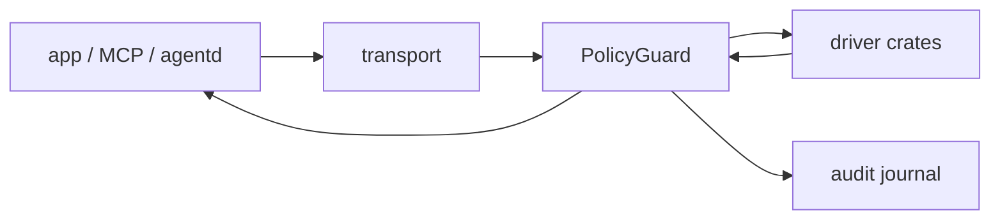
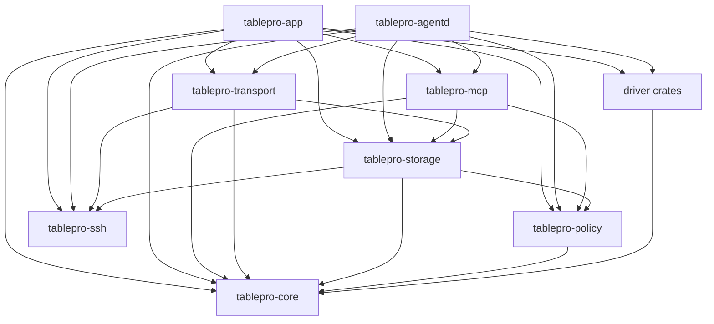

# Architecture

BookiE is a Linux-only native database client. The Rust 1.98 workspace lives under
`linux/`. The UI uses GTK4, libadwaita, GtkSourceView and Relm4. Domain, policy,
storage, SSH, transport, MCP and database drivers are separate crates so they can
be tested without starting the application.

The rename from TablePro covers the display name, installed binaries
(`bookie`, `bookie-agentd`) and branding only. Cargo crate names stay
`tablepro-*`. App ID, XDG config and data paths, keyring schema, UUIDs, audit
format and protocol contracts stay `tablepro` / `com.tablepro.linux`. Meson
installs `tablepro` and `tablepro-agentd` as symlinks to the BookiE binaries.
Check the [active sprint](docs/bookie-0.2-sprint.md) before renaming any stable
identifier.

This page matches the current `linux` tip manifests. The
[cross-session consistency review](docs/archive/architecture-consistency-review-2026-10-03.md)
is a dated source snapshot. Accepted [decisions](docs/decisions/README.md)
constrain implementation; the sprint owns delivery sequencing and acceptance.
Contributor rules live in [AGENTS.md](../AGENTS.md).

## Workspace layout

```text
linux/
├── Cargo.toml
├── crates/
│   ├── app/                 GTK composition root (crate binary tablepro-app → bookie)
│   ├── agentd/              headless MCP composition root (→ bookie-agentd)
│   ├── core/                domain types, driver traits, results, registry
│   ├── policy/              classify, rules, approval, masking, blast radius, audit
│   ├── mcp/                 auth, scopes, connection allowlists, rate limits, tools
│   ├── storage/             connections, Secret Service, history, audit journal
│   ├── transport/           driver options, SSH chain, tunnel, TLS service identity
│   ├── ssh/                 tunnels via russh or system OpenSSH
│   ├── driver-tls-tests/    test-only cross-driver certificate fixtures
│   ├── release-tests/       PostgreSQL release-fixture checks
│   └── drivers/             one static crate per engine (no app dependency)
├── tests/fixtures/          container fixtures for release checks
├── packaging/               Arch and Debian GitHub Release files
├── flatpak/                 GNOME 50 packaging and CI; publication unqualified
└── scripts/                 local checks, integration tests, and package helpers
```

Workspace driver crates: PostgreSQL, MySQL, SQLite, SQL Server, ClickHouse,
Redis, MongoDB and DuckDB. `crates/drivers/shared/` holds shared test helpers,
not a workspace member. Dependencies point toward `core`. Domain and driver
crates never import GTK or Relm4.

## Dependency direction

`tablepro-core` defines shared connection options, values, errors, operation control, and driver traits. It does not depend on another workspace crate.

Driver crates implement the core traits. They do not depend on GTK. SQLx backs PostgreSQL, MySQL, and SQLite; Tiberius backs SQL Server, while the remaining engines use their own crates. `rust_decimal` is the shared decimal carrier, with exactness established per engine and consumer under [ADR 0007](docs/decisions/0007-type-and-value-preservation.md). `tablepro-policy` depends on `core` only and applies authorization and audit rules around core connections. `tablepro-storage` owns saved connections, Secret Service access, query history, and the audit journal; it depends on core, policy audit types, and SSH configuration types. `tablepro-transport` depends on core, SSH and storage to assemble saved credentials and establish routes for the GUI and `agentd`. `tablepro-mcp` combines core, policy, and storage behavior for MCP clients; it never exposes a raw driver connection.

`tablepro-app` and `tablepro-agentd` are composition roots. They register drivers and assemble policy, storage, transport, and connection services for their process. `tablepro-release-tests` is a test-only consumer that assembles core, policy, SSH, storage, and the PostgreSQL driver against the release fixture. A new engine is a driver crate implementing the `core` contracts, added to both composition roots, with documented maturity in [adding drivers](docs/adding-drivers.md) and tests against a real engine.

## Data flow

Governed work follows one path whether it starts in the GTK app, an MCP tool or
`bookie-agentd`:

1. Resolve a saved connection and secrets (`storage`), then assemble dial
   options, SSH chain and TLS service identity (`transport`).
2. Open a driver connection and wrap it in `PolicyGuard` before any consumer
   sees it. MCP and agent code never hold a raw driver handle.
3. For each statement: classify, evaluate rules, request approval when required,
   apply masking, execute, write the audit outcome. Preview, transaction, retry
   and batch paths use the same checks as direct execution.
4. Return bounded results to the consumer. Late async outcomes must not replace
   state from a newer connection, query or request (generation or request id).



## Transport and service identity

`ConnectOptions` separates the address a driver dials from the service identity TLS must verify. A direct connection dials its own host. An SSH tunnel keeps the saved host and port as the service identity and supplies the local endpoint separately: a loopback TCP port for modes that do not verify certificates, or a Unix socket in a private directory when the driver reports a forwarded socket name. The socket form is what lets a verifying PostgreSQL connection check the certificate against the original database hostname while the bytes travel through the tunnel. Drivers without a forwarded socket name receive TCP. Verification depends on the driver's ability to separate the dial endpoint from the service identity: SQL Server and ClickHouse have explicit identity handling; PostgreSQL uses the socket path. Unsupported combinations must fail closed. A socket capability alone does not establish TLS readiness; consult the per-engine fixture evidence and B4 C6 acceptance.



Database drivers are linked into the binaries and registered in code. There is no runtime plugin ABI or driver discovery.

## Policy, MCP and agentd boundaries

Three checks are required for MCP. They answer different questions and none
replaces another:

| Boundary | Responsibility |
|---|---|
| MCP token scopes | Who may call which MCP tools. |
| Connection allowlists | Which saved connections that token may use. |
| `PolicyGuard` | What SQL may run: classify, evaluate rules, request approval, mask results, record audit, and contain a driver that stops mid-operation. |

MCP may ask policy whether a statement needs write capability for a scope check;
it does not evaluate rules or write audit records itself. A missing token, scope,
allowlist entry or policy decision denies access. A token scope never bypasses
`PolicyGuard`. Policy approval never bypasses a token's connection allowlist.
The GTK app and `tablepro-agentd` build guarded connection handles before
governed operations run.

Writes record an audit intent before driver execution and a terminal outcome afterward. Denied, failed, cancelled and timed-out operations still produce their terminal audit state. Required audit failures deny governed writes; audit failure never opens a path around policy. Recovered unresolved outcomes also keep governed writes disabled until they are handled.

A driver that panics is contained at the guard rather than lost with its task. The guard catches the unwind at every forwarded call and turns it into a `DriverError`: reads become `Internal`, and writes become `OperationOutcomeUnknown`, because a driver that stopped mid-statement cannot tell us whether the server applied it. The surrounding audit path then sees an ordinary error and records the required terminal state, so containment does not create a gap in the journal. The caught panic payload currently reaches `tracing`; it is omitted from the returned error, audit fields and interface. This is an implementation description, not a privacy guarantee: the payload and the default panic hook may expose sensitive data. The [privacy follow-up](docs/archive/architecture-consistency-review-2026-10-03.md#remaining-source-risks) remains open. Keep the unwinding panic strategy required by ADR 0006.

Because a panic leaves the connection's protocol state unverified, the guard also reports the fault through the optional `ConnectionFaultSink` its owner installs. `app::services::database_service` implements that sink and wakes the connection monitor, which replaces the connection instead of waiting for the next ping. A desynchronised connection can still answer a ping, so the fault path deliberately skips the ping and reconnects. `tablepro-mcp` and `tablepro-agentd` install no sink and keep the error conversion alone.

## Async and GTK ownership

GTK objects belong to the GLib main context. Database calls and other blocking or async service work run on Tokio through Relm4 command tasks. Results return to component update methods as messages.

Use component-scoped commands for work tied to a tab or component lifetime. Detached Relm4 tasks are reserved for independent persistence and cleanup work. Do not access GTK widgets from Tokio worker threads.

The application creates a short-lived Tokio runtime during startup to initialize and prune query history before Relm4 starts the main application loop.

## UI structure

The application owns an `AdwTabView` for connection workspaces. Tabs are represented by typed Rust state and backed by Relm4 controllers. The application component routes child output by tab UUID so tab controllers do not depend on each other.

Table tabs combine data browsing and structure views. Pending row changes and pending structure changes are tracked by tab UUID. Closing, saving, discarding, and reconnecting pass through application-level routing so cross-tab state is handled in one place.

Workspace state is persisted per connection. Unknown persisted tab kinds deserialize to an `Unknown` variant and are dropped during restore instead of failing the whole file.

Table browsing fetches bounded pages from the database. Each loaded page is held in a custom `gio::ListModel` (`RowStore`) behind GTK's list and selection models. The store retains the shared `QueryResult` and weakly caches GTK `RowObject`s for shared rows, preserving identity while consumers hold references and recreating a clean object after they release it. Draft and replacement rows remain strongly owned by the model. This bounds retained row objects around active consumers, not the page data itself. Arbitrary SQL editor results remain materialized up to row, cell and decoded-byte caps; progressive server-cursor paging is accepted in [ADR 0011](docs/decisions/0011-paged-query-results.md) but not implemented (PERF-2/PERF-8).

## Driver contract

Each driver exports a type that implements `tablepro_core::DatabaseDriver`. A successful connection returns a boxed `Connection` trait object. The connection trait covers query execution, parameterized operations, schema inspection, transactions, server activity, and controlled cancellation where supported.

[ADR 0007](docs/decisions/0007-type-and-value-preservation.md) owns type/value
semantics across these methods and their consumers. [ADR 0008](docs/decisions/0008-connection-and-session-ownership.md)
owns live handle/session trust and uncertainty; [ADR 0009](docs/decisions/0009-persistence-and-identity-compatibility.md)
owns durable identity and storage evolution. Their acceptance does not close
the remaining source/runtime gaps recorded on the owning boards.

`OperationControl` carries a cancellation token and an optional deadline. PostgreSQL controlled operations send a server cancellation request through a separate control pool, wait for the original operation to finish, and only return a connection to the pool when it is safe to reuse. Real PostgreSQL integration tests verify that cancelled and timed-out queries leave `pg_stat_activity` and that later queries still work.

See [docs/adding-drivers.md](docs/adding-drivers.md) for registration and test steps.

## Persistence

| Data | Backend | Default location |
|---|---|---|
| Saved connections | Versioned JSON | `$XDG_CONFIG_HOME/tablepro/connections.json` |
| Preferences | GSettings with JSON rollback mirror | `$XDG_CONFIG_HOME/tablepro/preferences.json` |
| Window state | GSettings geometry with JSON rollback mirror | `$XDG_CONFIG_HOME/tablepro/window.json` |
| Workspace tabs | JSON | `$XDG_CONFIG_HOME/tablepro/workspace_state.json` |
| Column widths | JSON | `$XDG_CONFIG_HOME/tablepro/column_widths.json` |
| Table filters | JSON | `$XDG_CONFIG_HOME/tablepro/filter_settings.json` |
| Query history | SQLite with FTS5 | `$XDG_CONFIG_HOME/tablepro/history.db` |
| Audit records | Hash-chained JSONL | `$XDG_DATA_HOME/tablepro/audit.jsonl` |
| Passwords and SSH secrets | Secret Service through `oo7` | Desktop keyring |

Preferences and geometry use the `com.tablepro.linux` GSettings schema when available; JSON remains the fallback and rollback mirror. The last connection id stays in `window.json`. Development builds use the separate `.Devel` schema and `tablepro-devel` paths. When an XDG variable is unset, config files fall back to `~/.config/tablepro/` and the audit journal falls back to `~/.local/share/tablepro/`.

See [docs/storage.md](docs/storage.md) for details verified against the current implementation.

## Build and CI

The default full check excludes the optional DuckDB driver because it compiles a large native dependency tree:

```bash
cargo clippy --workspace --exclude tablepro-driver-duckdb --all-targets -- -D warnings
cargo test --workspace --exclude tablepro-driver-duckdb --lib --bins
```

GitHub pull requests and pushes to `linux` or `main` run the cheap tier only
(guards, fmt, Clippy, unit, sandbox, GTK widgets, security, Flatpak when paths
match, workflow contracts). A green GitHub check is not merge acceptance.

The lab Forgejo runs the merge tier on every branch push: Docker drivers,
installed GTK, distro floor, packages, driver TLS, the PostgreSQL release
fixture and DuckDB. Gate with `bash linux/scripts/forgejo-gate.sh <branch>` from
the repository root. Documentation-only tips (only `*.md` and `linux/docs/`)
skip the heavy tiers after the doc link and ledger checks pass; see
[AGENTS.md](../AGENTS.md). Job lists and layer commands live in the
[validation playbook](docs/validation-playbook.md#ci-tiers).

GTK widget and soak checks use Debian testing containers for the GNOME 50
library baseline. Flatpak CI uses the GNOME 50 builder image. The Ubuntu 24.04
runner host is not the application's runtime baseline.

## Deliberate limits

- Linux is the only supported operating system.
- Drivers are statically linked.
- Redis is experimental and supports one host/port endpoint; Sentinel and Cluster topologies are deferred beyond 0.2.0.
- There is no embedded browser UI.
- There is no in-process user scripting runtime.
- Packaging targets Arch x86_64 first and Debian/GNOME amd64 next. Current 0.2 installed upgrade, rollback and native Wayland qualification remains open. A recipe or CI build is not publication approval; AUR and Flathub remain deferred.

## Browse query planning and asynchronous identity

`app::services::browse_query` constructs typed native-fetch or SQL/bound-parameter plans without GTK or database access. Page and count operations validate filters through one path; invalid filters dispatch no SQL. GTK owns request generations, errors and execution through the window's guarded connection.

Delayed sidebar refreshes carry an opaque token backed by a weak reference to the actual session, not only the reusable saved UUID. Results from a retired connection cannot replace the new sidebar. Tab-specific results retain their tab UUID; a connection switch tears down/recreates those tabs. Schema refresh waits for fresh column metadata before scheduling page/count reads.

The daemon's tunnel-owning wrapper forwards ordinary and controlled view metadata explicitly. Connection trait defaults are not evidence that every wrapper forwards a newly added capability; add wrapper contract tests when extending the trait.

Editor schema completion uses the same session token: allocating a fresh policy wrapper no longer invalidates its cache. Reconnect invalidates pending requests before they are applied.
